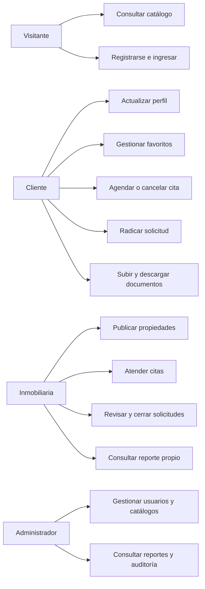

# Casos de uso de Habita

## Actores

| Actor | Alcance |
|---|---|
| Visitante | Consulta inicio, catálogo y detalle público. Puede registrarse o iniciar sesión |
| Cliente | Gestiona su perfil, favoritos, citas, solicitudes y documentos |
| Inmobiliaria | Administra su empresa, sus propiedades, citas recibidas, solicitudes, documentos y reportes propios |
| Administrador | Gestiona usuarios, roles, inmobiliarias, catálogos, propiedades, reportes generales y auditoría |
| PostgreSQL | Aplica llaves, restricciones, unicidad, bloqueos y transacciones |

## Diagrama general

## Especificaciones

### CU-01 Consultar propiedades

- Actor: visitante o usuario autenticado.
- Precondición: ninguna.
- Flujo: abre el catálogo, combina filtros GET, revisa tarjetas y abre el detalle.
- Alterno: si no hay coincidencias, el sistema muestra un estado vacío.
- Resultado: la consulta no modifica datos.

### CU-02 Registrar cuenta

- Actor: visitante.
- Precondición: el correo no está registrado.
- Flujo: completa nombres, apellidos, correo y contraseña; el servidor valida; una transacción crea usuario, perfil y rol CLIENTE.
- Alternos: correo duplicado, campos inválidos, contraseña corta o token vencido.
- Resultado: cuenta activa con contraseña PBKDF2 y perfil 1:1.

### CU-03 Iniciar y cerrar sesión

- Actor: usuario registrado.
- Precondición: cuenta activa y credenciales válidas.
- Flujo: el servidor verifica el hash, guarda ID y roles en sesión y dirige al panel. El cierre usa POST con token e invalida la sesión.
- Alternos: credenciales incorrectas, cuenta inactiva o bloqueo temporal tras cinco fallos.

### CU-04 Actualizar perfil

- Actor: cliente, inmobiliaria o administrador.
- Precondición: sesión activa.
- Flujo: abre su perfil, modifica datos y guarda. La foto acepta JPG o PNG hasta 2 MB.
- Alternos: formato o tamaño de foto inválido y datos fuera de longitud.
- Resultado: un solo perfil permanece asociado al usuario.

### CU-05 Publicar propiedad

- Actor: inmobiliaria o administrador.
- Precondición: la inmobiliaria tiene empresa vinculada.
- Flujo: registra matrícula, ciudad, tipo, operación, precio, área, habitaciones, baños y características.
- Alternos: matrícula duplicada, precio o área no positivos, catálogos inválidos.
- Resultado: propiedad activa y `DISPONIBLE`, asociada a la empresa responsable.

### CU-06 Gestionar favorito

- Actor: cliente.
- Precondición: sesión con rol CLIENTE.
- Flujo: agrega o quita una propiedad desde el detalle o el listado.
- Alterno: al agregar de nuevo, `ON CONFLICT DO NOTHING` evita el duplicado.
- Resultado: relación N:M cliente-propiedad actualizada.

### CU-07 Agendar visita

- Actor: cliente.
- Precondición: propiedad activa y `DISPONIBLE`.
- Flujo: elige fecha y hora futuras; el servidor bloquea participantes, verifica cruces y crea una cita `PENDIENTE`.
- Alternos: fecha pasada, propiedad ocupada, cruce del inmueble, del cliente o del responsable.
- Resultado: cita pendiente sin doble reserva activa.

### CU-08 Atender cita

- Actor: inmobiliaria propietaria o administrador.
- Precondición: cita perteneciente a la empresa.
- Flujo: confirma o rechaza; una cita confirmada pasada puede marcarse `REALIZADA`.
- Alternos: ID ajeno, transición inválida o intento de reabrir una cita cerrada.

### CU-09 Radicar solicitud

- Actor: cliente.
- Precondición: propiedad activa y `DISPONIBLE`.
- Flujo: escribe una observación y crea una solicitud `PENDIENTE`.
- Alterno: ya existe otra solicitud `PENDIENTE` o `APROBADA` del cliente sobre la propiedad.

### CU-10 Gestionar documento

- Actor: cliente dueño, inmobiliaria propietaria o administrador.
- Precondición: solicitud abierta.
- Flujo: el cliente carga PDF de máximo 5 MB; el servidor comprueba `%PDF-`, genera el nombre y guarda la ruta privada. Los actores autorizados descargan por el controlador.
- Alternos: archivo inválido, demasiado grande, ausente o acceso de un tercero.

### CU-11 Revisar y finalizar solicitud

- Actor: inmobiliaria propietaria o administrador.
- Precondición: solicitud y propiedad pertenecen a la empresa.
- Flujo: revisa documentos, aprueba la solicitud y la finaliza dentro de una transacción. La propiedad pasa a `VENDIDA` o `ARRENDADA` y las otras solicitudes abiertas se rechazan.
- Alternos: solicitud ajena, estado inválido, propiedad cerrada o segundo cierre concurrente.
- Resultado: solicitud y propiedad quedan consistentes o se revierte todo.

### CU-12 Consultar reportes y auditoría

- Actor: inmobiliaria o administrador; auditoría solo administrador.
- Flujo: la inmobiliaria consulta cifras de su empresa; el administrador consulta el consolidado. Auditoría permite filtrar por usuario, texto y fechas.
- Alterno: un rol no autorizado recibe 403.
